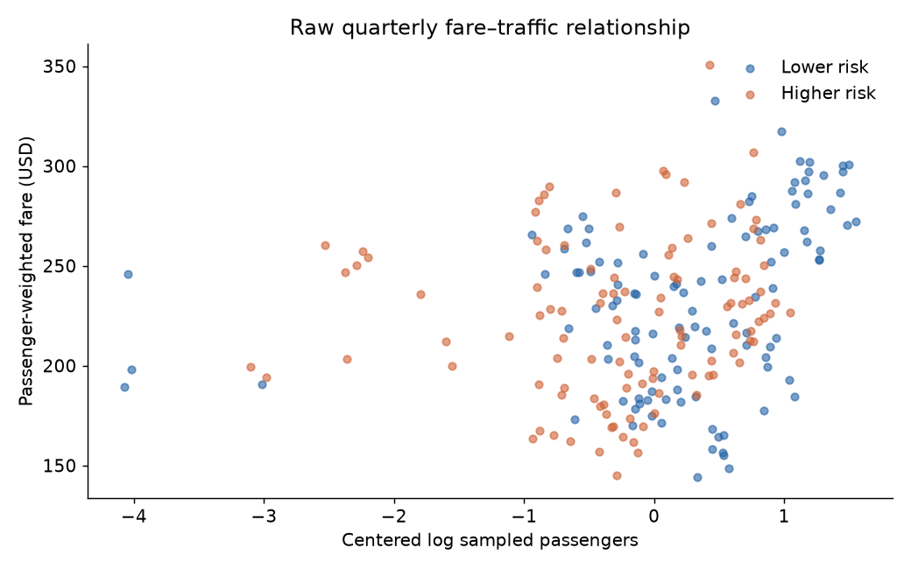
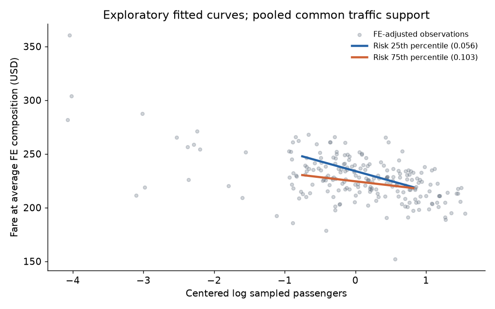
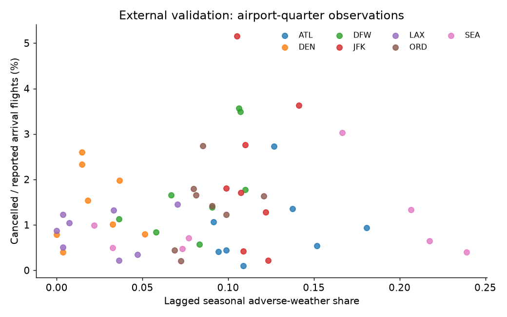
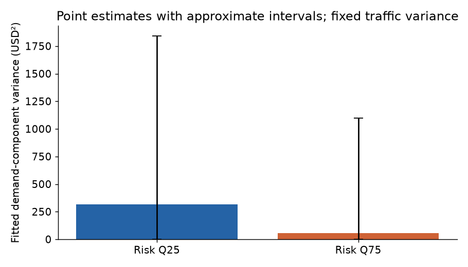

# Airline weather-risk pricing: Stage 0-4 assessment

Date: 2026-09-12. The authorized assessment and real aggregate pilot are complete.
Final verification passed 16 offline tests and reproduced all 19 table/figure files
byte-for-byte from raw inputs. This is not a completion claim for the unavailable
original flight/quote-time tests.

## Research question and scope

The original mechanism predicts higher fares at a reference demand state and a
flatter positive demand-to-price slope when quote-time operational/weather risk
is high: beta_R > 0 and beta_DR < 0. With an interaction, beta_R is only the risk
association at the chosen demand reference. It does not establish a literal fare
floor or a positive risk effect at every demand level.

The user selected BTS DB1B and authorized a narrower real-data pilot when exact
P/D/R alignment was unavailable. The implemented design uses passenger-weighted
prorated DB1B market fares from sampled ticket itineraries, passenger traffic,
and historical seasonal weather exposure.
Original H1/H2 remain not estimable. The aggregate analogues are exploratory.

## Literature and novelty

A targeted primary-source map verified 22 studies and covered all fifteen required
areas, with full-text versus abstract-level verification recorded. It is not an
exhaustive systematic review. Demand-responsive pricing, dispersion, refundability,
reliability-fare relationships, and probabilistic recovery already have substantial
literatures. The exact aligned quote-time interaction was not verified in this set.

Closest aggregate precedents include [Forbes (2008)](https://doi.org/10.1016/j.ijindorg.2007.12.004),
[Britto et al. (2012)](https://doi.org/10.1016/j.tre.2011.10.009), and
[Zou and Hansen (2014)](https://doi.org/10.1016/j.tre.2014.05.016). They motivate
competing quality-demand and operating-cost channels, so the risk sign is not
theoretically predetermined. Stage 1 rates the original aligned mechanism B,
incremental but defensible; a generic DB1B delay-fare analysis is much less novel.
See [literature review](../research/03_literature_review.md),
[novelty assessment](../research/04_novelty_assessment.md), and the evidence CSV.

## Data feasibility and actual pilot

Public direct BTS ZIP downloads were verified and implemented without an API key.
Market and Ticket were downloaded for all eight quarters of 2023-2024: sixteen
archives. Coupon endpoints were checked, but Coupon was not acquired because no
selected computation needs it and its class fields do not supply paired offered
products. Each raw response has a tracked checksum/provenance manifest. One
bounded download timed out and was successfully resumed and CRC-validated.

The [BTS source profile](https://www.transtats.bts.gov/DatabaseInfo.asp?QO_VQ=EFI&Yv0x=D)
describes quarterly sampled tickets. The pilot uses twelve directional routes:
ORD, DEN, DFW to ATL, LAX, JFK, SEA, and reporting carriers AA, DL, UA, WN where
observed. It scans 62.20 million Market and 38.08 million Ticket rows in chunks,
retaining 222 cells, 29 route/carrier groups, 211,651 Market records, and 618,324
sampled passenger weights. These are not unique people or full-population traffic.

Scope and exclusions were fixed before estimates: nonstop markets, nonbulk,
credible Ticket dollars, positive finite passengers, primary fares USD20-2000,
and at least 30 sampled passengers per cell. Broader USD10-5000 bounds are a
published sensitivity. Period-scoped joins had no unmatched Market records or
row expansion. No scoped duplicate Market keys occurred. Low-count cells are
excluded, not represented as zero fares. See the [quality report](../data/pilot_quality_report.md).

Fare offer timestamps, DTD, remaining inventory, booking velocity, and comparable
Basic/Standard/Flex offers are absent. No API credentials for fares were available,
and no additional paid service was used. Historical aggregate traffic and T-100
are possible additional measures, but neither alone identifies demand pressure.

## Weather risk and operational validation

The pilot requests daily ERA5 data from the
[Open-Meteo historical archive](https://open-meteo.com/en/docs/historical-weather-api)
at seven airports for 2020-2024, using public OurAirports coordinates, local-day
aggregation, explicit units, and one consistent model. ERA5 is retrospectively
retrieved reanalysis, not an archived fare-time information set.

An adverse day has precipitation >=10 mm, snowfall >=5 cm, or maximum 10m wind
>=15 m/s. These exploratory thresholds were fixed before estimates; they are not
certified runway operating limits. For each target year-quarter, use only that
season in the previous three years. Every source year-quarter meets 100% daily
coverage. Route risk is the average endpoint adverse-day share; maximum endpoint
exposure is a sensitivity. Missing values never become zero risk.

A small official [BTS Delay Causes download](https://transtats.bts.gov/OT_Delay/ot_delaycause1.asp)
supplies independent airport/month operational outcomes. Its selected 3,000 rows
yield 56 airport-quarter validation observations, with no missing match and no
duplicate airport/carrier/month keys. Cause counts reconcile within 0.02 flights
(declared rounding tolerance 0.05). Cancellations are divided by reported arrival
flights; weather-attributed delay counts do not identify weather cancellations.

Flightradar24 usage: **zero requests and zero credits**. Public BTS data met this
pilot's validation need. The 6,000-credit initial cap and no-paid-services rule
remain in force; the reported 60,000 monthly allocation was not touched.

## Methods and support

The primary model regresses passenger-weighted cell mean fare on centered log
sampled passengers, risk, their interaction, route/carrier FE, and year-quarter FE.
Centering corresponds to approximately 1,999 sampled passengers. The full model
has 222 observations, 39 parameters, full rank, and condition number 77.13.

Traffic is jointly determined with price, not an exogenous demand shifter.
Route/carrier and calendar controls do not solve simultaneity, capacity confounding,
traveler selection, product composition, or the ecological aggregation problem.
Risk varies at route-quarter, not independently across every carrier observation.

Primary uncertainty uses route-clustered CR1 covariance and t inference with eleven
degrees of freedom. Twelve clusters (and seven in airport validation) are few:
95% intervals and p-values are approximate and exploratory. No causal or
confirmatory claim rests on crossing a conventional significance threshold.

Residualized risk standard deviation after FE is 0.01885 versus raw 0.03573.
Only eight of 29 route/carrier groups span both pooled reference risk quartiles.
The fitted curves restrict traffic to pooled common central support, but common
coefficients across heterogeneous groups remain a substantive assumption.
Balanced-panel robustness checks temporal presence, not full identifying overlap.
Full diagnostics and joint-support tables accompany the estimates.

## Preliminary results

| Result | Point estimate | Approximate 95% interval |
| --- | ---: | ---: |
| Pooled log-traffic association | +9.80 USD | [-1.10, 20.70] |
| Log-traffic association with FE | -1.02 USD | [-31.40, 29.37] |
| Core risk effect per 10pp, at reference traffic | -20.52 USD | [-37.15, -3.88] |
| Core interaction coefficient | +227.55 USD | [-32.23, 487.33] |
| Traffic slope at risk Q25 (0.0562) | -18.26 USD | [-44.02, 7.50] |
| Traffic slope at risk Q75 (0.1026) | -7.70 USD | [-33.98, 18.57] |

Traffic slopes are USD per one natural-log point of sampled passengers. The
interaction is USD per log point per unit risk fraction: equivalently, a 10pp
risk increase changes that traffic slope by +22.75 USD per log point.

The aggregate risk and interaction point signs are opposite the proposed signs.
This is not a successful replication of the original mechanism, nor does it
disprove that mechanism with data capable of measuring it. The pooled versus FE
baseline changes substantially; a negative quantity-price association is compatible
with ordinary equilibrium demand/supply movements.

The adjusted curves hold FE composition fixed and have tabulated marginal intervals.
They are not observed quoted-fare schedules. The higher-risk curve lies lower near
reference traffic and becomes less steeply negative, which differs from the
hypothesized flattening of a positive demand slope by a negative interaction.

All thirteen predeclared fare fits were estimable. Passenger weighting, log fares,
broader bounds, maximum endpoint risk, balanced support, and all leave-one-hub-out
models retain a positive interaction point estimate. Precision varies: leave-one-
hub-out estimates range roughly +85 to +300, with only eight route clusters.
No specification was selected to recover a preferred sign.

The airport/calendar FE validation associates a 10pp historical index increase
with 6.86pp more realized adverse-weather days. Cancellation association is +0.67pp
with interval [-0.24, 1.59]pp, while weather-attributed delay association is +0.30pp
with interval [0.09, 0.51]pp. With seven clusters and an ecological design, these
are modest validation diagnostics, not a calibrated flight-failure probability.

## Dispersion and flexibility

At a fixed empirical log-traffic distribution, fitted demand-component variances
are 316.90 and 56.38 USD squared at risk Q25/Q75. Approximate confidence-set images
span [0, 1841.23] and [0, 1097.09]. The point decrease arises because a negative
slope approaches zero; it does not support the required negative interaction.
This calculation is separate from within-cell fare dispersion and variance of
quarterly means, and cannot establish that bad weather reduces total fare volatility.

Flexibility premiums are **not estimable**. A Coupon class label would not supply
paired restricted/flexible offer prices or their contract terms at a common time.

## What can and cannot be claimed

Can claim: lawful public batch acquisition works; a real reproducible quarterly
pilot exists; weather/outcome matching is complete; the specified aggregate model
does not exhibit the predicted signs; results and uncertainties are published.

Cannot claim: causal airline pricing behavior, quote-time forecast response,
exogenous demand sensitivity, a structural fare floor, a flexibility-option price,
lower total volatility, or novelty of a generic reliability-fare relationship.
The original hypothesis remains untested by this dataset.

## Recommendation for Stage 5

**C — Interesting empirical observation, weak paper.** The pipeline is usable,
but novelty, simultaneous price/quantity determination, sparse support, and
incompatible timing limit the research contribution. Do not scale this model or
spend FR24 credits simply to increase observations.

For a better aggregate paper, establish an external demand shifter or defensible
simultaneous/structural design and incorporate independent capacity/service controls
before estimation. For the original mechanism, obtain aligned repeated quotes,
validated inventory/booking signals, and timestamped forecast vintages. Prospective
collection is a separate future step and was not scheduled. Preserve the negative
results and reassess novelty before further investment.

## Reproduction and stage accounting

Install pinned `requirements.txt` in a local environment. From repository root:
`python -m pytest -q`, `python -m src.acquisition.batch --kind all`, and
`python -m src.run`. The latter verifies raw checksums and rebuilds from raw ZIPs.
`--analysis-only` is a convenience for reviewing derived cells, not a substitute
for raw-input reproducibility. See README for PowerShell commands and data terms.

Stages 0-2 are complete; Stage 3's aggregate pilot and feasible Stage 4 analyses
are complete. Stage 4's original quote-time H1/H2 and flexibility-premium tests
are explicitly unavailable. This is the partial-pilot completion interpretation
authorized in the execution addendum, not a claim that unavailable tests ran.
